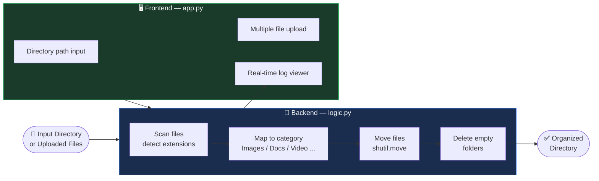
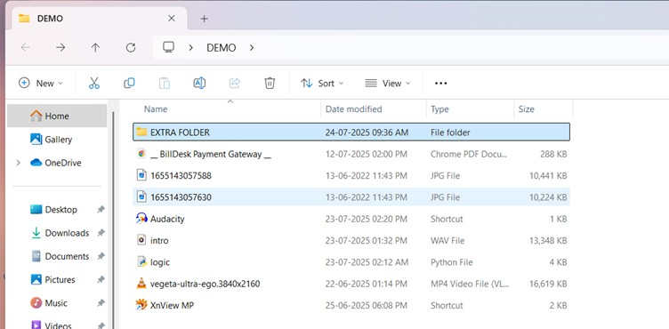
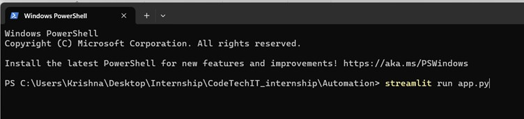
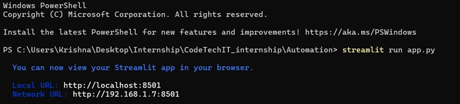
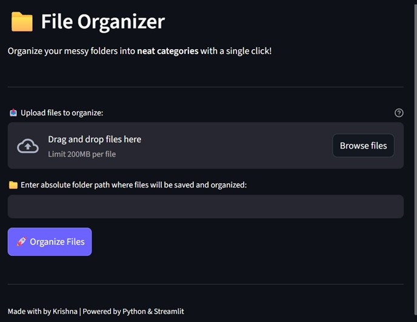
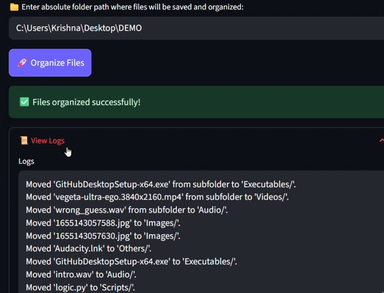
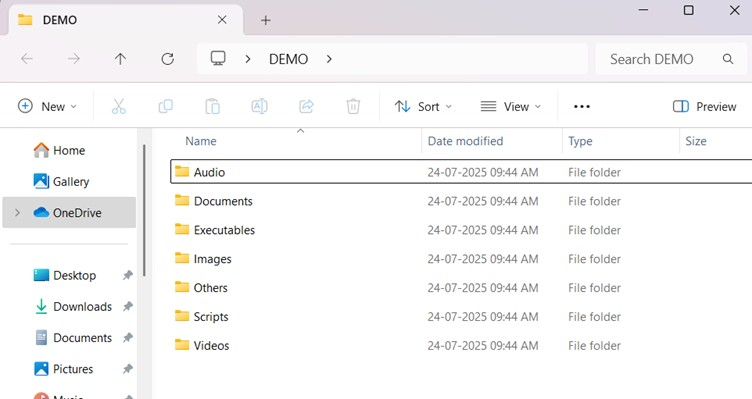

<div align="center">


</div>

<div align="center">

[](https://python.org)
[](https://streamlit.io)
[](.)
[](.)
[](https://task-automation.streamlit.app)

</div>

---

## 🧹 What It Does

**File Organizer Tool** is a lightweight automation utility that takes a messy, cluttered directory and sorts every file into the right folder — automatically — with zero manual effort.

Point it at any folder. Click organize. Done.

```
📁 Downloads/  (before)              📁 Downloads/  (after)
├── resume.pdf                       ├── 📄 Documents/
├── photo.jpg                        │   └── resume.pdf
├── video.mp4                        ├── 🖼️ Images/
├── script.py                        │   └── photo.jpg
├── archive.zip                      ├── 🎬 Videos/
└── song.mp3                         │   └── video.mp4
                                     ├── 💻 Scripts/
                                     │   └── script.py
                                     ├── 📦 Archives/
                                     │   └── archive.zip
                                     └── 🎵 Audio/
                                         └── song.mp3
```

Empty folders left behind? Automatically detected and deleted.

---

## 📂 File Categories

<div align="center">

| Category | Extensions |
|:---:|---|
| 🖼️ Images | `.jpg` `.png` `.gif` `.bmp` `.svg` `.webp` |
| 📄 Documents | `.pdf` `.docx` `.txt` `.xlsx` `.pptx` `.csv` |
| 🎬 Videos | `.mp4` `.mkv` `.avi` `.mov` `.wmv` |
| 🎵 Audio | `.mp3` `.wav` `.aac` `.flac` `.ogg` |
| 📦 Archives | `.zip` `.rar` `.7z` `.tar` `.gz` |
| ⚙️ Executables | `.exe` `.msi` `.dmg` |
| 💻 Scripts | `.py` `.js` `.html` `.css` `.ts` `.sh` |
| 📁 Others | Everything else |

</div>

---

## 🏗️ How It Works



---

## 🗂️ Project Structure

```
Task_Automation/
├── app.py          ← Streamlit web interface
├── logic.py        ← File detection, moving, cleanup logic
├── requirements.txt
└── screenshots/
    ├── unorganised-folder.jpg
    ├── Terminal-Command-1.jpg
    ├── Terminal-Command-2.jpg
    ├── Streamlit-Browser.jpg
    ├── Upload-files-1.jpg
    ├── Upload-files-2.jpg
    └── organised-folder.jpg
```

---

## 🛠️ Tech Stack

<div align="center">

[](https://python.org)

| Tool | Role |
|---|---|
| **Python** | Core language |
| **Streamlit** | Web-based UI — directory input, file upload, log display |
| **os** | Directory traversal and path handling |
| **shutil** | File move operations |

</div>

---

## 🚀 Getting Started

### 1️⃣ Install

```bash
pip install streamlit
```

### 2️⃣ Run

```bash
streamlit run app.py
```

✅ Opens at `http://localhost:8501`

---

## ✨ Features

| Feature | Description |
|---|---|
| 📁 **Directory Input** | Paste any local path to organize an existing folder |
| 📤 **File Upload** | Upload multiple files directly via the browser |
| 🚀 **One-Click Organize** | Single button triggers full sort + cleanup |
| 🧾 **Live Log Viewer** | Real-time action log — see every file move as it happens |
| 🧹 **Empty Folder Cleanup** | Automatically removes leftover empty directories |
| 🎨 **Dark Mode UI** | Clean, minimal dark-themed interface |

---

## 🎨 Screenshots

### 📂 Before — Unorganized Folder
<p align="center">
  
</p>

---

### 🖥️ Running the App
<p align="center">
  
  &nbsp;
  
</p>

---

### 🌐 Streamlit Interface
<p align="center">
  
</p>

---

### 📤 File Upload in Action
<p align="center">
  
  &nbsp;
  
</p>

---

### ✅ After — Organized Folder
<p align="center">
  
</p>

> 🗑️ Empty folders are automatically detected and deleted after organization.

---

## 💡 Key Learnings

- File system automation with Python (`os`, `shutil`)
- Directory traversal and recursive cleanup logic
- Building user-friendly tools with Streamlit
- Handling edge cases — locked files, duplicates, unknown extensions

---

## 📌 Roadmap

- [ ] Custom category creation by user
- [ ] Undo / rollback last organization
- [ ] Scheduled automation (cron / task scheduler)
- [ ] Cloud storage support (Google Drive, Dropbox)
- [ ] Drag-and-drop file interface

---

<div align="center">


**Krishna** · Python Programming Intern · CodeTech IT Solutions

[](https://task-automation.streamlit.app)

⭐ Found this useful? Give it a star!

</div>
