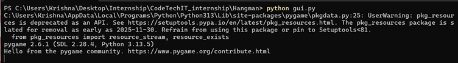
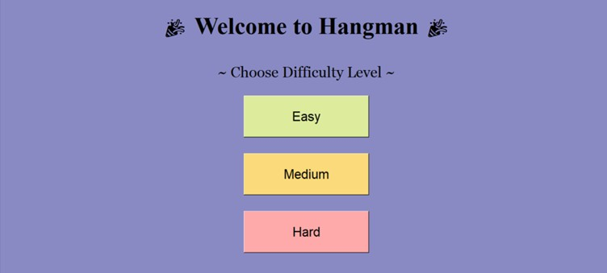
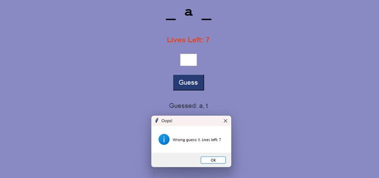
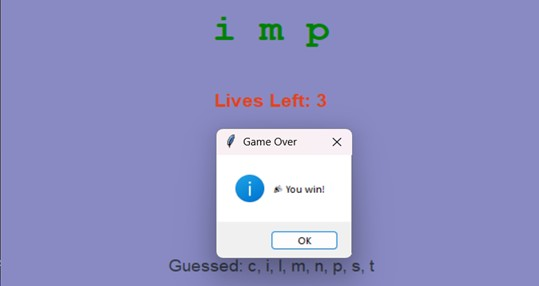

# 🎮 Hangman Game --- Python Mini Project


A fun and interactive **Hangman Game** built using **Python** and
**Tkinter**, featuring difficulty levels, real-time word fetching, audio
feedback, and a clean graphical interface.

This project was developed as part of my **Python Programming Internship
at CodeTechIT Solutions**.

------------------------------------------------------------------------

## 🧠 Objective

The objective of this project was to implement the classic **Hangman**
game while combining: - Backend game logic - GUI-based interaction - API
integration - Audio feedback

This project strengthened my understanding of **OOP**, **event-driven
programming**, **GUI design**, and **multithreading** in Python.

------------------------------------------------------------------------

## 🛠 Technologies & Libraries Used

  Component   Description
  ----------- -------------------------------------------
  Python      Core programming language
  Tkinter     GUI framework
  Pygame      Sound effects & background music
  Requests    Fetch random words from external API
  Threading   Prevent UI blocking during audio playback

------------------------------------------------------------------------

## 📂 Project Structure

``` text
Hangman/
│── gui.py          # Main GUI application
│── logic.py        # Game logic & rules
│── sounds/         # Sound effects & music
│── assets/         # Images / UI assets (if any)
│── requirements.txt
│── README.md
```

------------------------------------------------------------------------

## ⚙️ Features

-   🎚 **Difficulty Levels** -- Easy, Medium, Hard (dynamic lives & word
    length)
-   🔊 **Audio Feedback** -- Correct/incorrect guess, win/loss sounds
-   🧠 **Smart Word Logic** -- API-based word fetch with offline
    fallback
-   💻 **Responsive GUI** -- Built with Tkinter widgets
-   🧵 **Multithreading** -- Smooth audio without freezing UI
-   ❌ **Robust Error Handling** -- Handles invalid input & API failures

------------------------------------------------------------------------

## 🔧 Setup Instructions

### 1️⃣ Install Python

Download from: https://www.python.org/

### 2️⃣ Install Required Libraries

``` bash
pip install pygame requests
```

> Note: `tkinter` comes pre-installed with most Python versions.

### 3️⃣ Run the Game

``` bash
python gui.py
```

------------------------------------------------------------------------

## 🎨 Screenshots

### 🖥 Terminal Command
<p align="center">
  
</p>

---

### 🎬 Splash Screen
<p align="center">
  
  
  
</p>

---

### 🎯 Right & Wrong Guess Feedback
<p align="center">
  
  
</p>

---

### 🏆 Win & ❌ Lose Screens
<p align="center">
  
  
</p>

---

### ⚠️ Invalid Input Handling
<p align="center">
  
  
</p>

------------------------------------------------------------------------

## 💡 Key Learnings

-   Applied **OOP principles** in a real project
-   Designed interactive GUIs with **Tkinter**
-   Integrated **live API data**
-   Improved responsiveness using **threading**
-   Enhanced UX with **audio integration**

------------------------------------------------------------------------

## 📌 Future Improvements

-   🏆 Leaderboard / Score tracking
-   🎨 Enhanced UI with images & animations
-   📦 Convert into `.exe` using **PyInstaller**
-   🌐 Online multiplayer mode (stretch goal)

------------------------------------------------------------------------

## 🧑‍💻 Author

**Krishna**\
Python Programming Intern -- CodeTechIT Solutions

------------------------------------------------------------------------

⭐ If you enjoyed this project, feel free to give it a star!
