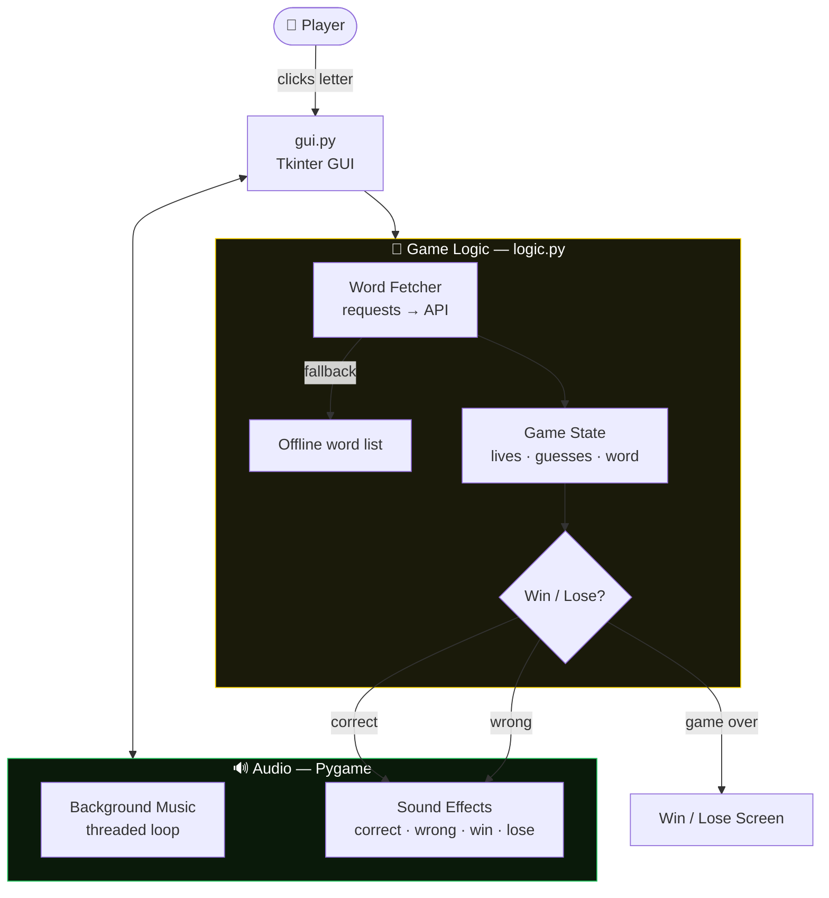
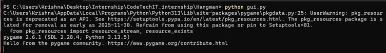
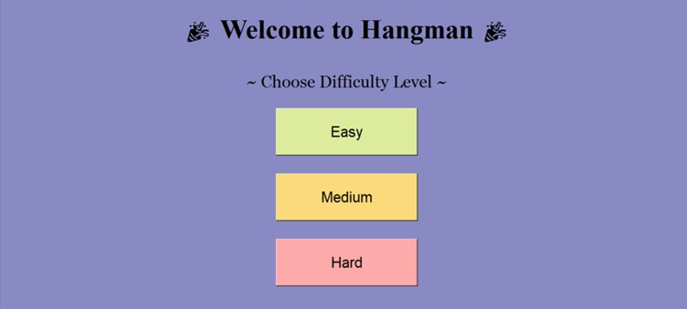
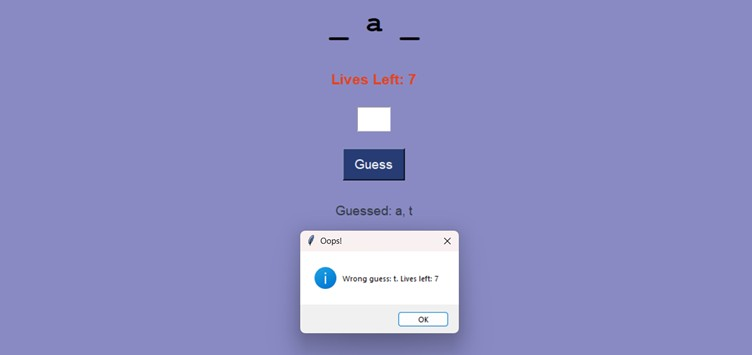
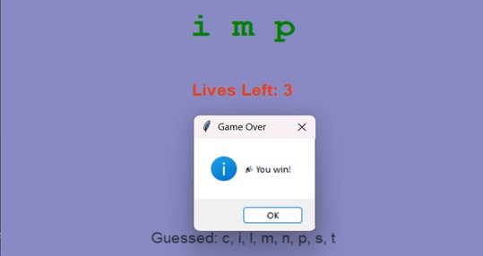

<div align="center">


</div>

<div align="center">

[](https://python.org)
[](https://docs.python.org/3/library/tkinter.html)
[](https://pygame.org)
[](https://pypi.org/project/requests/)
[](.)
[](LICENSE)

</div>

---

## 🎮 What It Is

**Hangman** is the classic word-guessing game — fully rebuilt in Python with a polished GUI, real-time word fetching from a live API, difficulty levels, and audio feedback for every guess.

```
_ _ _ _ _ _ _     ← guess the word before you run out of lives

  Wrong guesses:  B  Z  Q  X       Lives left: 3 / 6
  Difficulty:     HARD             Word length: 7 letters

  [ A ] [ B ] [ C ] [ D ] [ E ] ...
```

Pick a difficulty. Start guessing. Don't get hanged.

---

## ✨ Features

<div align="center">

| Feature | Details |
|---|---|
| 🎚️ **Difficulty Levels** | Easy · Medium · Hard — dynamic lives and word length per level |
| 🔊 **Audio Feedback** | Correct guess · wrong guess · win · lose — all with sound effects |
| 🎵 **Background Music** | Continuous Pygame audio playback throughout gameplay |
| 🧠 **Smart Word Fetching** | Live random words from external API with offline fallback |
| 💻 **Responsive GUI** | Full Tkinter-based graphical interface — no terminal play |
| 🧵 **Multithreading** | Audio runs in separate thread — UI never freezes |
| ❌ **Error Handling** | Invalid input, duplicate guesses, and API failures handled gracefully |
| 📦 **Portable** | Packaged as `.exe` via PyInstaller — no Python install needed |

</div>

---

## 🎯 How to Play

```
1.  Launch the game  →  splash screen appears
2.  Select difficulty  →  Easy / Medium / Hard
3.  A random word is fetched from the API (or fallback list)
4.  Guess one letter at a time using the on-screen keyboard
5.  ✅ Correct guess  →  letter reveals + sound plays
    ❌ Wrong guess    →  hangman draws + life lost + sound plays
6.  Win  →  reveal the word + win screen + win sound
    Lose →  game over screen + lose sound + word revealed
```

---

## 🏗️ Architecture


```mermaid
flowchart TD
    U([👤 Player]) -->|clicks letter| GUI[gui.py\nTkinter GUI]

    GUI --> LG

    subgraph LG [🧠 Game Logic — logic.py]
        direction TB
        WF[Word Fetcher\nrequests → API]
        WF -->|fallback| WL[Offline word list]
        WF --> GM[Game State\nlives · guesses · word]
        GM --> WIN{Win / Lose?}
    end

    subgraph AU [🔊 Audio — Pygame]
        direction LR
        BG[Background Music\nthreaded loop]
        SFX[Sound Effects\ncorrect · wrong · win · lose]
    end

    WIN -->|correct| SFX
    WIN -->|wrong| SFX
    WIN -->|game over| GOS[Win / Lose Screen]
    GUI <--> AU

    style LG fill:#1a1a0a,stroke:#FFD700,color:#ffffff
    style AU fill:#0a1a0a,stroke:#22C55E,color:#ffffff
```

---

## 🎚️ Difficulty Levels

<div align="center">

| Level | Lives | Word Length | Vibe |
|:---:|:---:|:---:|---|
| 🟢 Easy | 8 | Short (3–5 letters) | Learning the game |
| 🟡 Medium | 6 | Medium (6–8 letters) | Standard experience |
| 🔴 Hard | 4 | Long (9+ letters) | For the brave |

</div>

---

## 🗂️ Project Structure

```
Hangman/
├── gui.py              ← Main Tkinter application + event handling
├── logic.py            ← Game rules, word fetch, state management
├── sounds/             ← Audio assets
│   ├── background.mp3  ← Background music (looped)
│   ├── correct.wav     ← Correct guess sound
│   ├── wrong.wav       ← Wrong guess sound
│   ├── win.wav         ← Win sound
│   └── lose.wav        ← Lose sound
├── assets/             ← UI images / hangman stage graphics
├── requirements.txt
└── README.md
```

---

## 🛠️ Tech Stack

<div align="center">

[](https://python.org)

| Tool | Role |
|---|---|
| **Python** | Core language |
| **Tkinter** | GUI framework — windows, buttons, labels, canvas |
| **Pygame** | Background music + sound effect playback |
| **Requests** | Live word fetch from external random word API |
| **Threading** | Runs audio in a separate thread — keeps UI responsive |

</div>

---

## 🚀 Getting Started

### 1️⃣ Install Dependencies

```bash
pip install pygame requests
```

> `tkinter` ships with Python — no separate install needed.

### 2️⃣ Run the Game

```bash
python gui.py
```

---

## 🎨 Screenshots

### 🖥️ Launch

<p align="center">
  
</p>

---

### 🎬 Splash Screen

<p align="center">
  
  
  
</p>

---

### 🎯 Correct vs Wrong Guess

<table align="center">
  <tr>
    <td align="center">
      <br/>
      <em>✅ Correct Guess</em>
    </td>
    <td align="center">
      <br/>
      <em>❌ Wrong Guess</em>
    </td>
  </tr>
</table>

---

### 🏆 Win and Lose Screens

<table align="center">
  <tr>
    <td align="center">
      <br/>
      <em>🏆 You Win!</em>
    </td>
    <td align="center">
      <br/>
      <em>💀 Game Over</em>
    </td>
  </tr>
</table>

---

### ⚠️ Invalid Input Handling

<p align="center">
  
  
</p>

---

## 💡 Key Learnings

- Applied **OOP principles** across gui.py and logic.py separation
- Designed interactive GUIs with **Tkinter** — event-driven architecture
- Integrated **live API data** with a graceful offline fallback
- Used **threading** to keep audio non-blocking — smooth UX throughout
- Enhanced UX with **Pygame audio** — sounds tied to game state changes

---

## 📌 Roadmap

- [ ] 🏆 Leaderboard and score tracking across sessions
- [ ] 🎨 Animated hangman stages with images
- [ ] 📦 `.exe` build via PyInstaller for distribution
- [ ] 🌐 Online multiplayer mode
- [ ] 🗂️ Category-based word selection (Animals, Tech, Sports...)

---

<div align="center">


**Krishna** · Python Programming Intern · CodeTechIT Solutions

*Can you guess the word before it's too late?*

⭐ If you enjoyed this project, give it a star!

</div>
