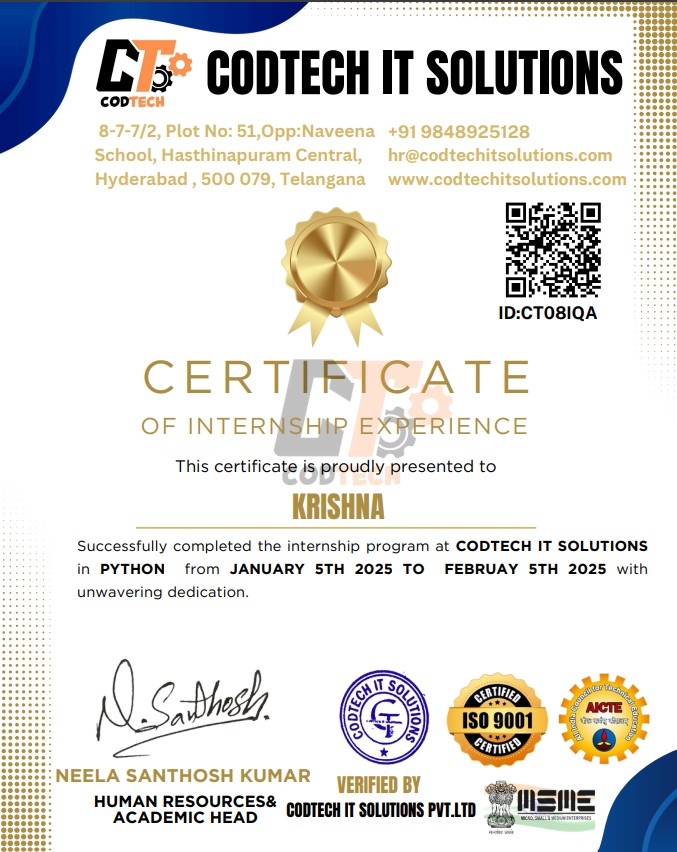

---

## 👋 About This Internship

I completed a **1-month virtual Python Development Internship** at **CodeTech IT Solutions Pvt. Ltd.** from **January 5 – February 5, 2025**, building three end-to-end Python projects across automation, game development, and financial analytics.

Each project was scoped, built, and shipped independently — going from requirement to working application with real data, real UIs, and real deployment.

---

## 🛠️ Projects Built

### 🗂️ 01 — Task Automation · File Organizer Tool

> Automatically organizes cluttered directories into categorized folders — Images, Documents, Videos, Audio, Scripts, and more. Built with a clean Streamlit web interface for non-technical users.

`Python` `Streamlit` `os` `shutil`

---

### 📈 02 — Stock Portfolio Tracker & Research Dashboard

> A real-time investment dashboard — track your portfolio, analyze profit/loss, and visualize stock price and volume trends with live market data.

`Python` `Streamlit` `yfinance` `matplotlib` `seaborn` `JSON`

---

### 🎮 03 — Hangman Game · GUI Desktop App

> A classic Hangman game reimagined — difficulty levels, real-time word fetching from an API, background music, and sound effects. Fully packaged as a desktop executable.

`Python` `Tkinter` `Pygame` `Requests`

---

## 🧠 Skills Developed

 

| Area | What I Learned |
|---|---|
| 🐍 **Core Python** | OOP, file handling, error handling, multithreading |
| 🖥️ **GUI Dev** | Tkinter layouts, event-driven programming, Pygame audio |
| 🌐 **Web Apps** | Streamlit — forms, charts, real-time data, session state |
| 🤖 **Automation** | File system traversal, shutil operations, edge case handling |
| 📊 **Data Viz** | matplotlib + seaborn — trend charts, volume charts, styled plots |
| 🔗 **APIs** | yfinance (stock data), requests (word API), JSON persistence |
| 🔊 **Multimedia** | Pygame audio integration, background music, sound effects |

---

## 🏆 Internship Certificate

📅 **January 5, 2025 – February 5, 2025** &nbsp;·&nbsp; 🏢 **CodeTech IT Solutions Pvt. Ltd.**

 

  

---

## 🎯 Outcomes

- Built **3 complete, deployable Python projects** from scratch
- Shipped **2 live Streamlit web apps** with public URLs
- Gained hands-on experience with **real-world APIs and data pipelines**
- Learned to design applications for **non-technical end users**
- Strengthened debugging, documentation, and code organization habits

---

**Krishna** · Python Development Intern · CodeTech IT Solutions Pvt. Ltd.

*This internship reflects practical, end-to-end Python development experience.*

⭐ Star this repo if it was useful!

