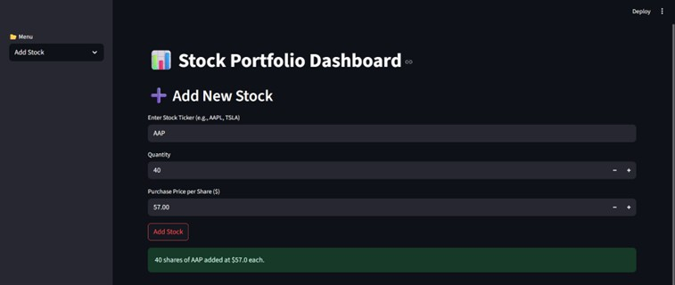
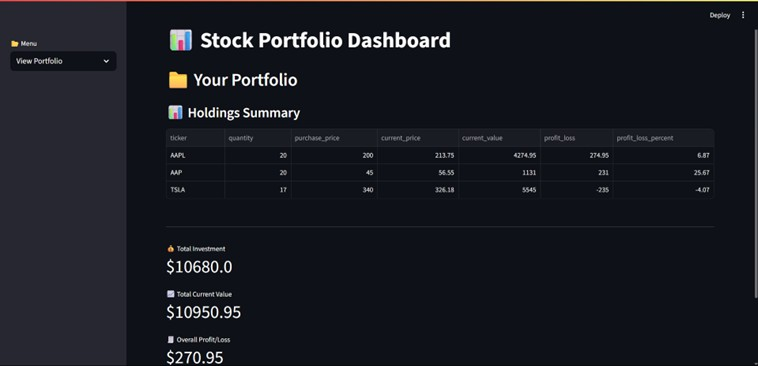
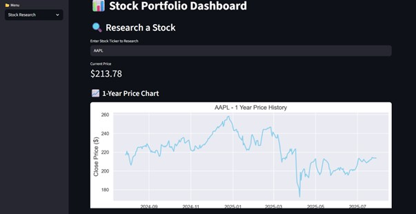
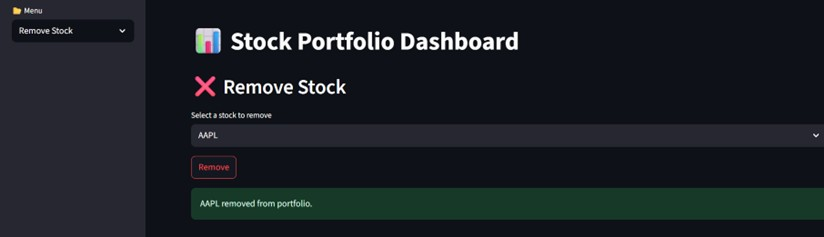

# 📈 Stock Portfolio Tracker & Research Dashboard


 

A smart, interactive **Stock Portfolio Tracker & Research Dashboard**
built using **Python** and **Streamlit** that helps users manage
investments, analyze real-time stock data, and visualize market trends
effortlessly.

This project was developed as part of my **Python Full Stack Internship
at CodeTechIT Solutions**.

------------------------------------------------------------------------

## 🎯 Project Objective

The goal of this project is to provide an easy-to-use dashboard that
enables users to:

-   📊 Track personal stock portfolios with real-time **profit & loss
    analysis**
-   🔍 Research stock prices and historical performance
-   📈 Visualize trends using clean and informative charts
-   ➕ Add or ❌ remove stocks dynamically through a web interface
-   💾 Persist portfolio data locally for future use

------------------------------------------------------------------------

## 🚀 Project Architecture

### 🔧 Backend Logic (`logic.py`)

-   Manages portfolio data using **JSON-based persistence**
-   Calculates total investment, current value, and profit/loss
-   Fetches real-time stock prices using `yfinance`
-   Supports 1-year historical stock data

### 🎨 Data Visualization (`visuals.py`)

-   Uses **Matplotlib** and **Seaborn**
-   Generates:
    -   Closing price trend charts
    -   Volume trend charts

### 🖥 Frontend Dashboard (`dashboard.py`)

-   Built using **Streamlit**
-   Add, remove, and view portfolio
-   Research stock prices instantly
-   Displays charts inline with summary metrics

------------------------------------------------------------------------

## 🧰 Technologies Used

  Tool         Purpose
  ------------ ---------------------------
  Python       Core programming language
  Streamlit    Web dashboard
  yfinance     Stock data API
  matplotlib   Plotting
  seaborn      Styled charts
  json & os    Data persistence

------------------------------------------------------------------------

## ⚙️ Installation & Setup

### 1️⃣ Install Dependencies

``` bash
pip install streamlit yfinance matplotlib seaborn
```

### 2️⃣ Run the App

``` bash
streamlit run dashboard.py
```

------------------------------------------------------------------------

## ✨ Features

-   📥 Add Stock
-   ❌ Remove Stock
-   📊 Portfolio Summary
-   🔍 Stock Research
-   📈 Yearly Price & Volume Charts
-   💾 Local JSON Storage

------------------------------------------------------------------------

## 📌 Future Enhancements

-   User authentication
-   Multi-portfolio support
-   CSV export
-   Technical indicators (RSI, Moving Average)
-   Cloud deployment

------------------------------------------------------------------------
## 🎨 Screenshots


<p align="center">
  
  
  
  
</p>


---

## 🧑‍💻 Author

**Krishna**\
Python Full Stack Intern -- CodeTechIT Solutions

------------------------------------------------------------------------

⭐ If you like this project, consider giving it a star!
