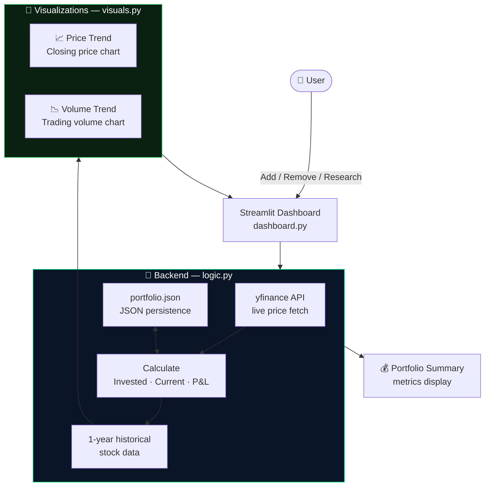
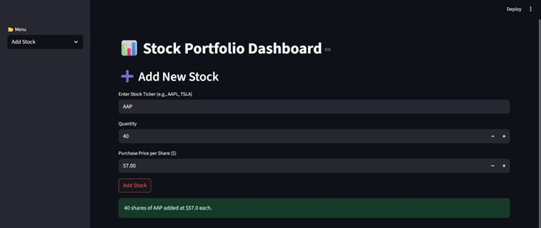
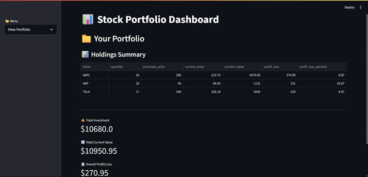
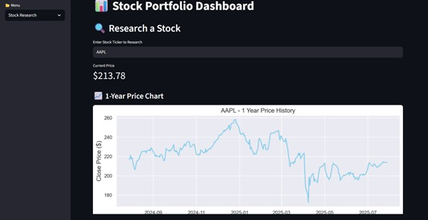
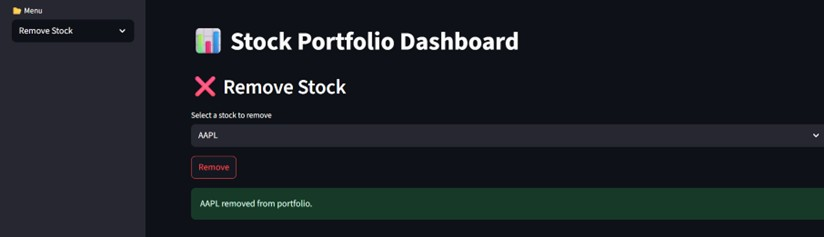

<div align="center">


</div>

<div align="center">

[](https://python.org)
[](https://streamlit.io)
[](https://pypi.org/project/yfinance/)
[](https://matplotlib.org)
[](https://seaborn.pydata.org)
[](.)
[](https://stock-portfolioo.streamlit.app)

</div>

---

## 📈 What It Does

**Stock Portfolio Tracker** is a personal investment dashboard that gives you a clear, real-time picture of your portfolio — what you bought, what it's worth now, and whether you're up or down.

```
Add stocks  →  fetch live prices  →  calculate P&L  →  visualize trends
```

No spreadsheets. No manual price lookups. Just your portfolio, live — in a clean web interface.

---

## ✨ Features

<div align="center">

| Feature | Description |
|---|---|
| 📥 **Add Stock** | Add a ticker + quantity + buy price to your portfolio |
| ❌ **Remove Stock** | Remove any holding with one click |
| 📊 **Portfolio Summary** | Total invested · current value · overall P&L |
| 🔍 **Stock Research** | Instant price lookup for any ticker |
| 📈 **1-Year Price Chart** | Closing price trend over the past year |
| 📉 **Volume Chart** | Trading volume trend per stock |
| 💾 **Persistent Storage** | Portfolio saved to JSON — survives app restarts |

</div>

---

## 🏗️ Architecture


```mermaid
flowchart TD
    U([👤 User]) -->|Add / Remove / Research| DB[Streamlit Dashboard\ndashboard.py]

    DB --> LG

    subgraph LG [🔧 Backend — logic.py]
        direction TB
        YF[yfinance API\nlive price fetch]
        JS[portfolio.json\nJSON persistence]
        YF --> CALC[Calculate\nInvested · Current · P&L]
        JS <--> CALC
        CALC --> HIST[1-year historical\nstock data]
    end

    HIST --> VZ

    subgraph VZ [🎨 Visualizations — visuals.py]
        direction LR
        PC[📈 Price Trend\nClosing price chart]
        VC[📉 Volume Trend\nTrading volume chart]
    end

    LG --> SUM[💰 Portfolio Summary\nmetrics display]
    VZ --> DB

    style LG fill:#0a1628,stroke:#00FF88,color:#ffffff
    style VZ fill:#0a2010,stroke:#22C55E,color:#ffffff
```

---

## 🗂️ Project Structure

```
Stock_Portfolio/
├── dashboard.py       ← Streamlit frontend — UI, layout, interactions
├── logic.py           ← Portfolio management, yfinance data, P&L calc
├── visuals.py         ← Matplotlib + Seaborn chart generators
├── portfolio.json     ← Local portfolio data store (auto-created)
├── requirements.txt
└── screenshots/
    ├── sample-screen-1.jpg
    ├── sample-screen-2.jpg
    ├── sample-screen-3.jpg
    └── sample-screen-4.jpg
```

---

## 🛠️ Tech Stack

<div align="center">

[](https://python.org)
[](https://matplotlib.org)

| Tool | Role |
|---|---|
| **Python** | Core language |
| **Streamlit** | Web dashboard — add/remove stocks, charts, metrics |
| **yfinance** | Live stock prices + 1-year historical OHLCV data |
| **matplotlib** | Price and volume trend charts |
| **seaborn** | Chart styling and visual polish |
| **json + os** | Local portfolio persistence across sessions |

</div>

---

## 🚀 Getting Started

### 1️⃣ Install Dependencies

```bash
pip install streamlit yfinance matplotlib seaborn
```

### 2️⃣ Run the App

```bash
streamlit run dashboard.py
```

✅ Dashboard opens at `http://localhost:8501`

---

### Using the Dashboard

```
1. Go to "Add Stock" → enter ticker (e.g. AAPL), quantity, buy price
2. Your portfolio appears with current price + P&L calculated live
3. Click any stock → view 1-year price and volume charts
4. Use "Research" tab → look up any ticker instantly
5. Use "Remove Stock" → clean up holdings anytime
```

> **Tip:** Portfolio data is saved automatically to `portfolio.json` — your holdings persist between sessions.

---

## 📊 Screenshots

<p align="center">
  
</p>
<p align="center">
  
</p>
<p align="center">
  
</p>
<p align="center">
  
</p>

---

## 📌 Roadmap

- [ ] User authentication + multi-portfolio support
- [ ] CSV export of portfolio history
- [ ] Technical indicators — RSI, Moving Average, Bollinger Bands
- [ ] Price alerts and notifications
- [ ] Cloud deployment with persistent storage

---

<div align="center">


**Krishna** · Python Full Stack Intern · CodeTech IT Solutions

[](https://stock-portfolioo.streamlit.app)

⭐ If this helped you, give it a star!

</div>
